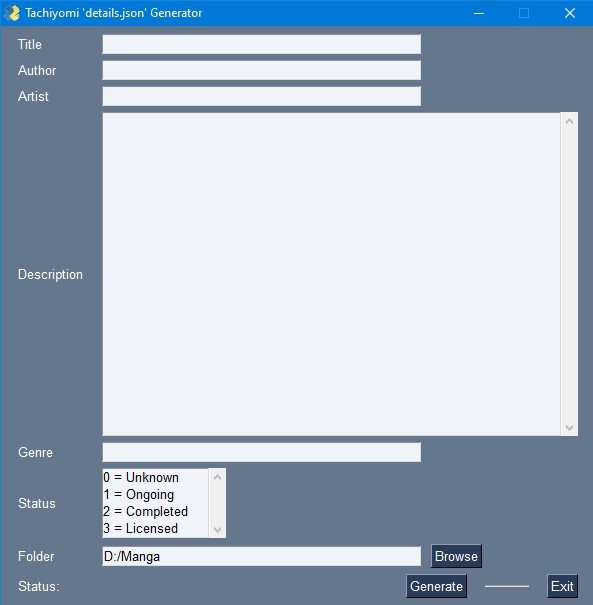

Executable file only works on Windows.
Built using PySimpleGUI

[Release page](https://github.com/kdleextra/MangaDetails-GUI/releases)

This python scripts help manually make the details.json for Tachiyomi local manga
using the format as shown at [Reading local manga](https://tachiyomi.org/help/guides/reading-local-manga/#editing-local-manga-details)

Note:
  >> Description will have its linebreak removed when writing to the json file.

  >> Genre should enter in the format:
        genre1, genre2, ..., genreN

  >> Status of manga must be chosen!!!

